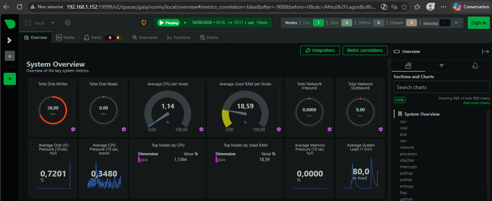
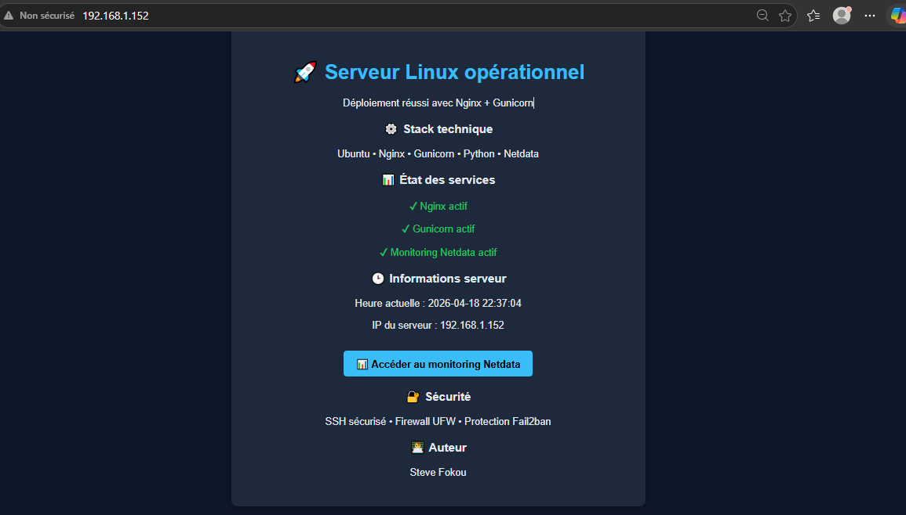

# 🚀 Déploiement et Sécurisation d’un Serveur Linux

## 📌 Description

Ce projet présente la mise en place complète d’un serveur Linux incluant le déploiement d’une application web, la configuration d’un reverse proxy, la sécurisation des accès et la supervision en temps réel.

L’objectif est de démontrer des compétences pratiques en administration système, réseau et sécurité.

---

## ⚙️ Technologies utilisées

- Ubuntu Server
- Nginx (Reverse Proxy)
- Gunicorn (serveur WSGI)
- Python (application backend)
- systemd (gestion des services)
- UFW (pare-feu)
- Fail2ban (protection contre les attaques)
- Netdata (monitoring en temps réel)

---

## 🧱 Architecture

Client → Nginx → Gunicorn → Application Python

- Nginx reçoit les requêtes HTTP
- Redirige vers Gunicorn
- Gunicorn exécute l’application Python

---

## 🚀 Déploiement

- Installation et configuration d’un serveur Ubuntu
- Mise en place d’un reverse proxy avec Nginx
- Déploiement d’une application Python via Gunicorn
- Création d’un service systemd pour assurer la persistance

---

## 🔐 Sécurisation du serveur

Une attention particulière a été portée à la sécurité :

- Accès SSH sécurisé par authentification par clé (désactivation du mot de passe)
- Restriction des ports via UFW (accès limité aux services essentiels)
- Protection contre les attaques brute-force avec Fail2ban

👉 Objectif : réduire la surface d’attaque et sécuriser l’accès au serveur

---

## 📊 Monitoring

Mise en place de Netdata pour superviser en temps réel :

- Utilisation CPU
- Mémoire (RAM)
- Activité disque
- Trafic réseau
- Processus système (Nginx, Gunicorn, etc.)

👉 Dashboard accessible via le port 19999

---

## 📸 Captures d’écran

### Monitoring Netdata

### Application accessible via navigateur

---

## 🎯 Compétences démontrées

- Administration système Linux
- Configuration réseau (ports, accès, services)
- Mise en place d’un reverse proxy
- Gestion des services avec systemd
- Sécurisation d’un serveur (SSH, firewall, Fail2ban)
- Monitoring et supervision des performances

---

## 💡 Améliorations possibles

- Mise en place du HTTPS (Let’s Encrypt)
- Containerisation avec Docker
- Centralisation des logs
- Monitoring avancé avec Grafana

---

## 👨‍💻 Auteur

Projet réalisé dans le cadre de préparation à un poste en administration systèmes et réseaux.
